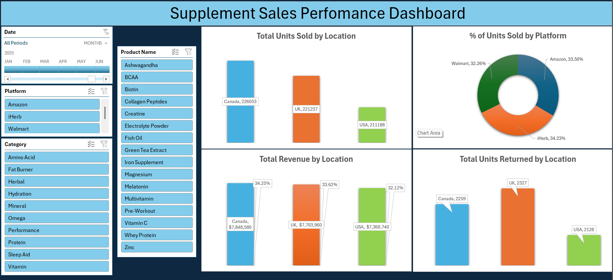

## **Data Analytics Projects**

## **Project 1**  
**Title:** [Supplement Sales Performance 2020–2025](https://github.com/Ali-HassanBad/alhassan-portfolio.github.io/blob/main/Supplement_Sales.xlsx)

**Tools Used:** Microsoft Excel (Power Query, Pivot Tables, Pivot Charts, Slicers, Timelines)

### **Project Description:**  

This project involved analysing supplement sales data across Canada, the UK, and the USA from 2020 to 2025. Using Excel’s Power Query and Pivot capabilities, the dataset was cleaned, structured, and visualised to uncover trends, market differences, and platform performance. The dashboard provides an intuitive, interactive view of key sales metrics and patterns over time.

Key features of the dashboard include:

- **Revenue by Country:** A visual comparison of total revenue generated in Canada, the UK, and the USA.
- **Units Sold by Region:** Displays the volume of supplements sold across each market.
- **Platform Distribution:** A breakdown of total units sold via Amazon, iHerb, and Walmart.
- **Products Returned by Region:** Tracks return patterns to assess customer satisfaction and product performance.

Interactive slicers and a timeline were included to allow filtering by:

- **Supplement Category** (e.g. Protein, Vitamin, Omega, etc.)
- **Specific Products** (e.g. Whey Protein, Creatine, Collagen Peptides)
- **Sales Platform** (Amazon, iHerb, Walmart)
- **Year Range** (2020–2025)

### **Key Findings:**
- **Regional Sales Leaders:** Canada led overall in revenue, contributing over 35% of total sales. However, sales leadership fluctuated year to year—most notably in 2021 and 2023, the UK outperformed Canada in total sales volume.
- **Revenue Parity in 2021:** Despite the UK’s lead in unit sales for 2021, the revenue gap between Canada and the UK was minimal: £1,423,489 (33.15%) versus £1,479,046 (34.44%) respectively.
- **Platform Insights:** iHerb emerged as the leading sales platform, responsible for 35.79% of unit sales, followed by Amazon and Walmart.
- **Customer Returns:** Return rates were consistently low and nearly identical across all three countries, suggesting steady customer satisfaction.
- **Market Normalisation:** By 2025, sales trends stabilised and returned to familiar patterns, indicating a maturing market.
- **Performance Shifts:** The USA, while initially trailing, overtook the UK in 2024, suggesting increased market penetration or improved product engagement.

This dashboard serves as a dynamic business intelligence tool for stakeholders, enabling strategic planning, inventory management, and targeted marketing through clear, actionable insights.

## **Dashboard Overview:**

## **Project 2**  
**Title:** Sales Records  

**Technology Used:** Microsoft SQL Server  

**SQL Code:** [Sales Records – Data Interrogation and Manipulation](https://github.com/Ali-HassanBad/alhassan-portfolio.github.io/commit/7161c0e66e10e1445c0f14d90d89605d55ee1b9b)  

**SQL Functions Used:** 
- **Data Retrieval (SELECT):** Queried and extracted specific information from the database.

- **Data Filtering (WHERE):** Applied filters to select relevant data, including filtering by ranges and lists.
 
- **Data Source Specification (FROM):** Specified the tables used as data sources for retrieval.

- **Data Integration (JOIN):** Combined data across tables to create a unified view.

- **Data Sorting (ORDER BY):** Organised results to highlight patterns and trends.

- **Data Manipulation (INSERT INTO):** Added new records into the dataset for analysis and testing.

### **Project Description:**  

This project explored sales data across multiple relational tables with the goal of extracting valuable insights and demonstrating foundational SQL querying techniques.  
The work involved filtering datasets using conditions, integrating tables to enhance context, sorting results for analytical clarity, and inserting new sample data records to simulate realistic workflows.  
Through these techniques, the project showcases core SQL capabilities used in day-to-day data interrogation tasks—laying a strong foundation for more advanced visualisation and dashboarding efforts.

## **Project 3**  
**Title:** [Netflix by the Numbers](https://github.com/Ali-HassanBad/alhassan-portfolio.github.io/blob/main/Netflix%20by%20the%20Numbers.pbix)

**Tools Used:** Microsoft Power BI (Power Query, Data Modelling, Slicers, Interactive Visuals)

### **Project Description:**  
This project analysed Netflix’s global content additions across more than 100 countries between 2008 and 2021. Built entirely in Power BI, the dashboard presents a detailed view of how the platform’s catalogue evolved—by region, content type, and audience classification.

Key features of the dashboard include:

- **Total Films Added (Card):** Summary of all titles added over the 14-year timeframe  
- **Films Added by Year (Line Chart):** Displays a steady growth in content, with a sharp rise from 2014 and a sudden decline in 2020  
- **Content Type Breakdown (Donut Chart):** Compares the proportion of Movies versus TV Shows  
- **Top 10 Countries by Content Volume (Ribbon Chart):** Highlights regional contributions and year-on-year shifts  
- **Content Ratings (Funnel Chart):** Categorises titles by viewer rating (e.g. TV-MA, PG, R)

Interactive slicers were included for:

- **Unknown Director, Cast, and Country:** Filters to examine metadata completeness  
- **Release Year:** Enables year-specific trend analysis  
- **Category:** Allows users to drill into genres such as Drama, Comedy, or Documentary

### **Key Findings:**  
- **Rapid Growth Phase:** Content additions increased sharply from 2014, mirroring Netflix’s international expansion  
- **Content Mix Evolution:** Movies remained dominant, though TV show additions steadily increased after 2017  
- **Regional Leaders:** The United States led in volume, followed by India and the United Kingdom  
- **Metadata Completeness Issues:** A notable portion of entries lacked key fields such as director, cast, or country—especially in earlier years  
- **Rating Distribution:** The most frequent ratings were TV-MA and PG, indicating a focus on mature and family-oriented content  
- **2020 Decline:** The dip in new titles during 2020 may reflect the global impact of the COVID-19 pandemic on film production and distribution pipelines. Widespread filming delays, studio closures, and disruptions to international content delivery likely contributed to the temporary slowdown.

## **Dashboard Overview**

 
